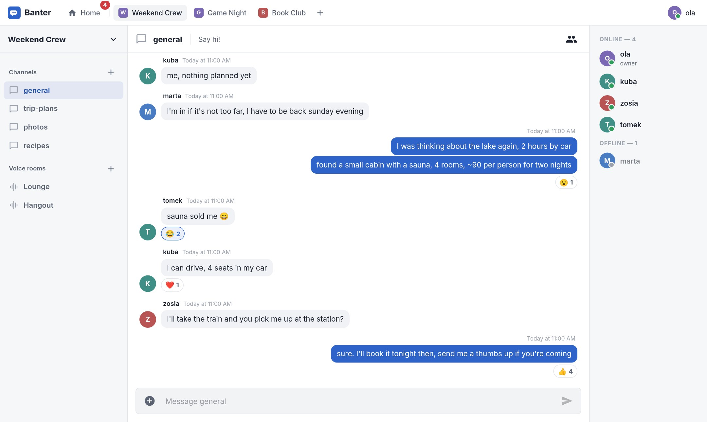
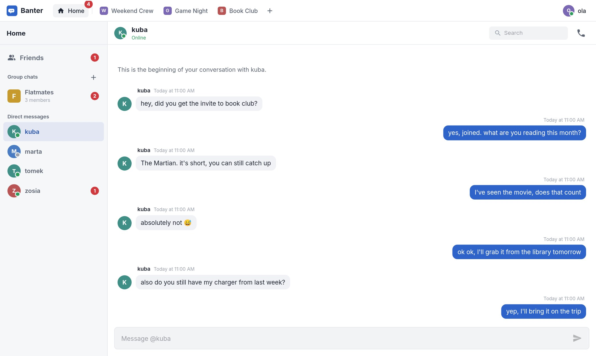
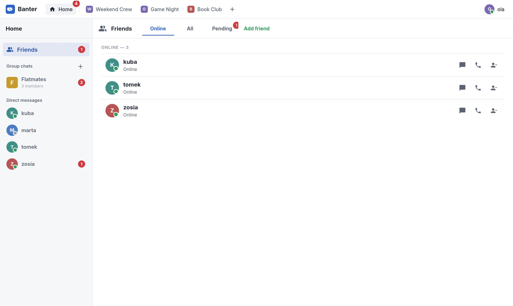

# Banter

Komunikator czasu rzeczywistego w przeglądarce. Serwery z kanałami tekstowymi i głosowymi, znajomi, wiadomości prywatne i grupowe oraz rozmowy głosowe.



| Wiadomości prywatne | Znajomi |
| --- | --- |
|  |  |

## Technologie

- **Backend:** .NET 10, ASP.NET Core Web API, Entity Framework Core (SQLite), Identity + JWT, SignalR
- **Frontend:** React 19, TypeScript, Vite, MUI, MobX, React Router, WebRTC
- **Wdrożenie:** Docker

## Uruchomienie

### Docker

Wymagania: Docker z Docker Compose.

```bash
cp .env.example .env
docker compose up -d --build
```

Aplikacja działa pod adresem http://localhost:8080. Baza danych i przesłane pliki są trzymane w wolumenach Dockera.

### Bez Dockera

Wymagania: .NET 10 SDK, Node.js 22+.

```bash
dotnet publish Banter.Api -c Release -o publish
cd publish
Jwt__Key="twoj-dlugi-losowy-klucz-min-32-znaki" ASPNETCORE_URLS=http://localhost:8080 dotnet Banter.Api.dll
```
